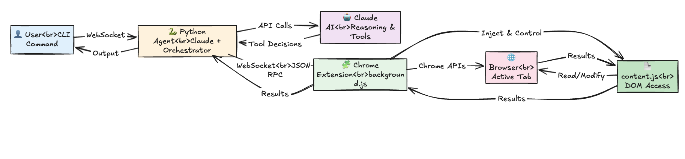

# Point&Click Mini Computer‑Use Agent

Minimal Claude‑style agent that pilots a Chrome Extension via a localhost WebSocket bridge.

## ✨ What it does

- Takes a natural language task (e.g., "Open Gmail and list promo emails I've not opened in 3 months").
- Runs an Agent loop (Claude w/ Tools) that invokes browser actions (navigate, wait, query, click, type…).
- The Chrome extension performs those actions safely in the active tab and returns observations.

## 🧩 Architecture



- **Extension (MV3)** exposes a narrow set of DOM tools via `content.js` and tab/Download tools via `background.js`.
- **Python** runs a WebSocket server and an **Orchestrator** using Anthropic Claude Tools.
- Messages are JSON RPCs: `{type, id, method, params}` with structured results.

## ⚙️ Setup

### 1. Clone the Repository
```bash
git clone <repository-url>
cd pointclick_agent
```

### 2. Install Python Dependencies
```bash
python3 -m venv .venv
source .venv/bin/activate  # On Windows: .venv\Scripts\activate
cd client
pip install -r requirements.txt
```

### 3. Configure Environment Variables
```bash
cp .env.example .env
```

Edit `.env` and add your Anthropic API key:
```
ANTHROPIC_API_KEY=sk-ant-your-key-here
ANTHROPIC_MODEL=claude-sonnet-4-5-20250929
WS_HOST=127.0.0.1
WS_PORT=8765
```

### 4. Load the Chrome Extension

1. Open Chrome and navigate to `chrome://extensions/`
2. Enable **Developer mode** (toggle in top-right corner)
3. Click **Load unpacked**
4. Select the `extensions` folder from this repository
5. The extension icon should appear in your toolbar

### 6. Run Commands

With the extension awake, run your automation tasks:

```bash
# Make sure you're in the client directory and venv is activated
cd client
source ../.venv/bin/activate  # If not already activated

# Run a task
python run.py "Open google.com and search for AI news"
```

## 🚀 Usage Examples

```bash
# Download task
python run.py "Go to picsum.photos, find an image, extract its source URL, and download it"

# Gmail automation
python run.py "Open Gmail and list unread promo emails from the last 3 months" 

# Research task
python run.py "Find the latest paper on Hugging Face Daily Paper about UI Agents"

# Multi-step workflow
python run.py "Open my github and check my current open pull requests"

# Tab switch
python run.py "Open google.com in a new tab, then switch to tab 0, then switch back to tab 1" 

```

## 🔧 Troubleshooting

### "Extension did not connect within timeout"

**Cause:** The Chrome extension service worker is asleep.

**Solution:** Wake up the extension by refreshing the extrension from the browser.

### WebSocket connection fails

**Solution:** 
1. Check that no other process is using port 8765
2. Verify `WS_PORT` in `.env` matches the extension's expected port
3. Try restarting Chrome completely

## 📋 Available Tools

The agent has access to these browser automation tools:

- **navigate** - Open URLs
- **read_viewport** - Get page content
- **query_text** - Extract text or attributes from elements
- **click** - Click elements
- **type** - Type into input fields
- **press_key** - Send keyboard events
- **wait_for_selector** - Wait for elements to appear
- **scroll** - Scroll the page
- **switch_tab** - Switch between browser tabs
- **download** - Download files
- **upload_file** - Trigger file upload dialogs

## 📝 Advanced Usage

### Running Demo Strategies
```bash
python demo_strategies.py
```

## 📚 Documentation

For more details on:
- Tool schemas: See `client/tools.py`
- System prompt: See `client/system_prompt.md`
- Extension API: See `extensions/` directory

## 🤝 Contributing

Issues and pull requests are welcome!